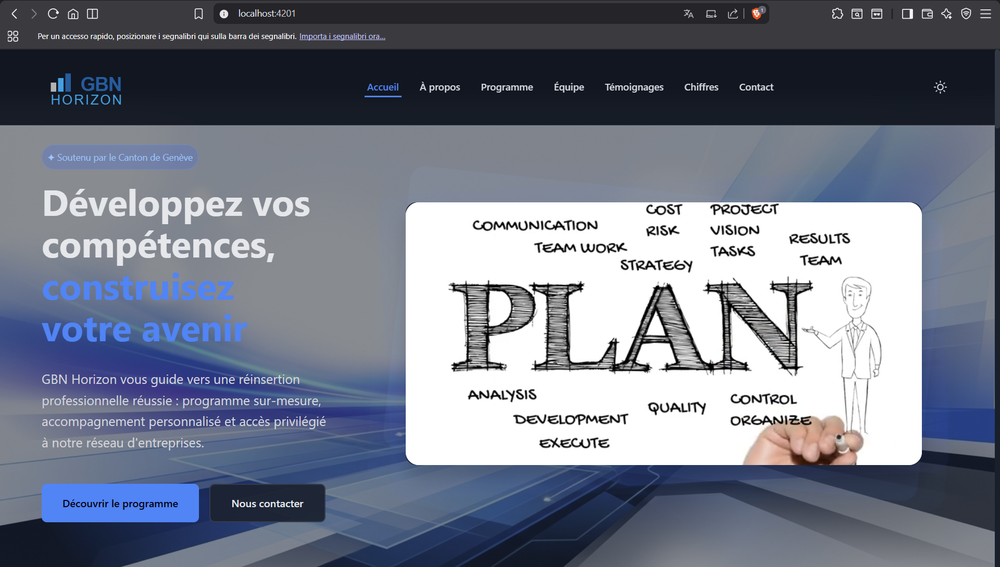
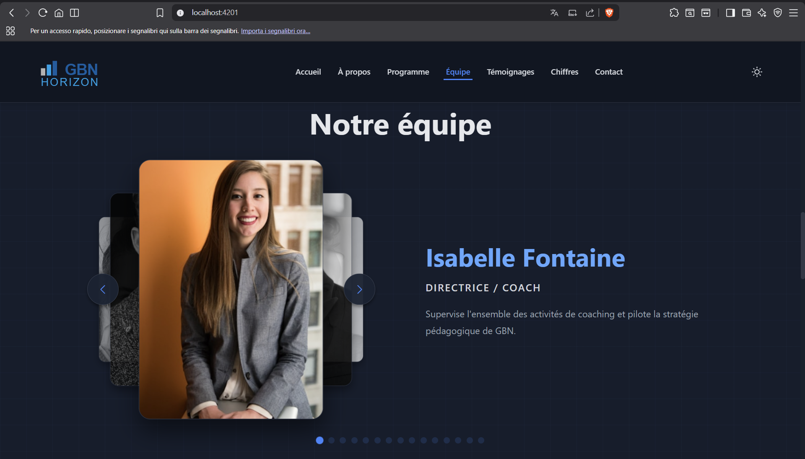
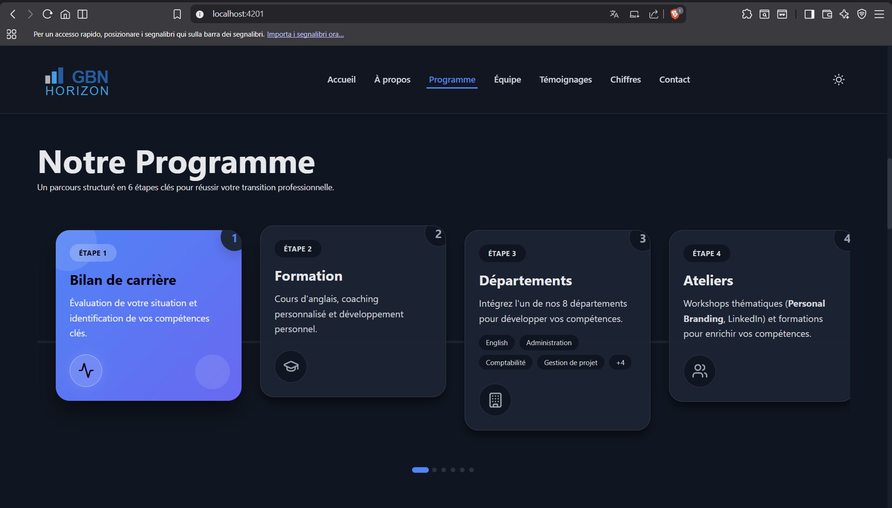
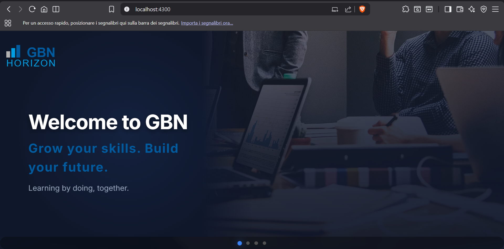
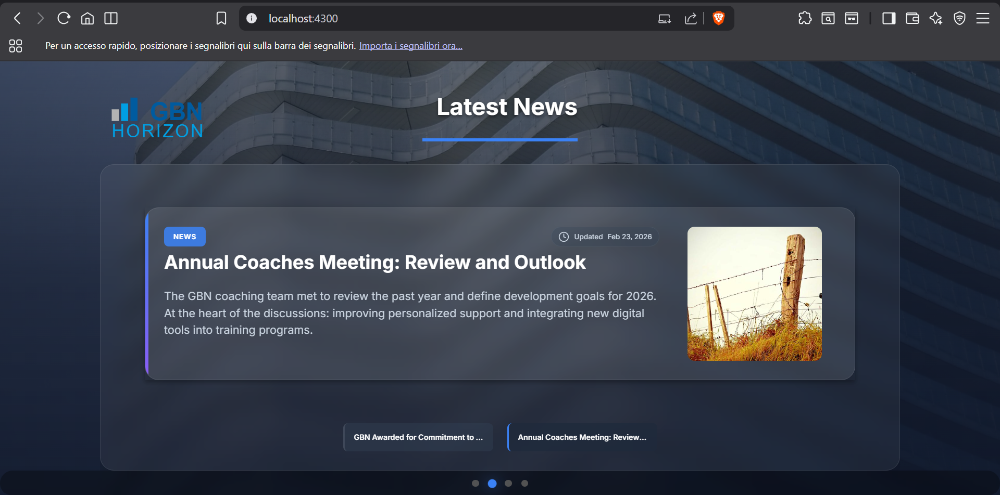
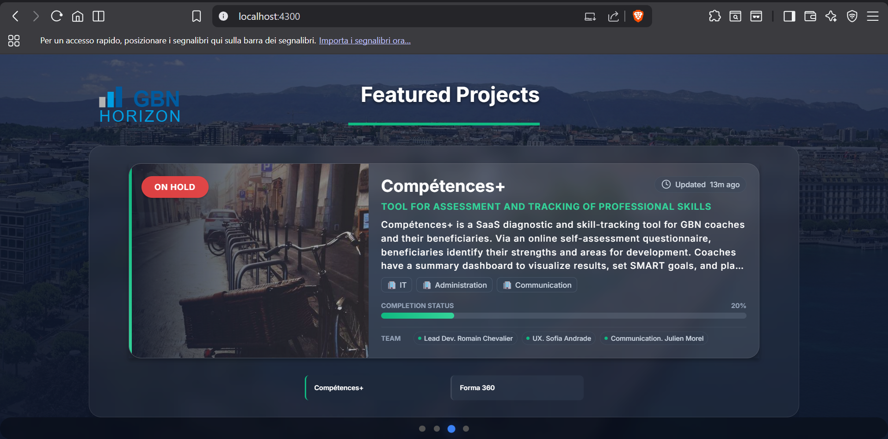
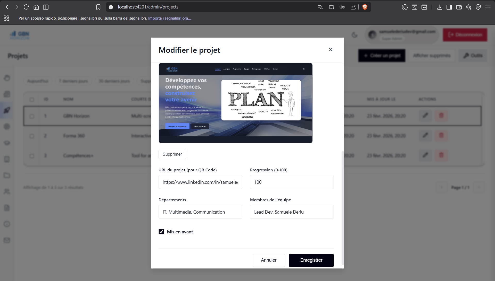
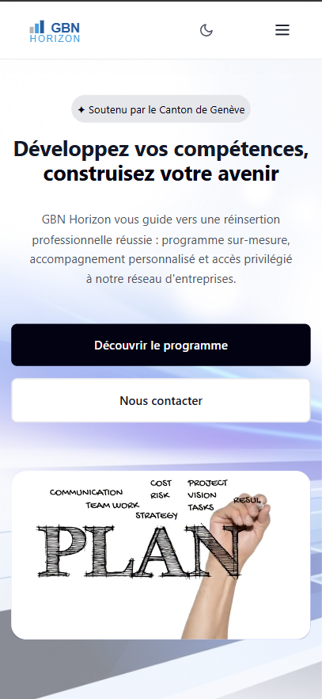
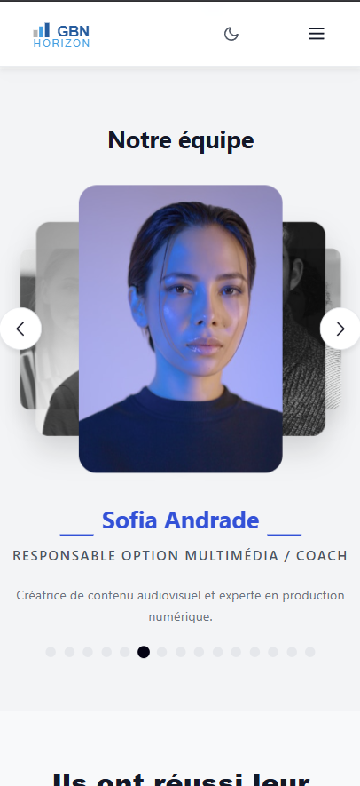

# 📺 GBN Horizon - Digital Signage & Management System

> **Important Note:** The source code for this project is hosted in a private repository due to confidentiality and Non-Disclosure Agreements (NDA). This repository serves as a **Case Study** to illustrate the architecture, technical achievements, and UI/UX design. All personal data and photos have been replaced with **Mock Data** and **Royalty-Free Assets** for this public showcase.

## 📌 The Origin & Challenge

GBN initially requested a solution to broadcast internal company information across their office TVs (powered by Raspberry Pis without internet access) and simultaneously offer this broadcast as a desktop "widget" for employee workstations.

Adopting an **Agile & Scrum methodology**, I collaborated closely with the stakeholders to identify the core information they needed to display. This process allowed me to design a system perfectly tailored exactly to their operational needs, ensuring maximum clarity and utility.

## ✨ The Solution & Features

I architected a completely customized ecosystem where content, display timing, and layout bounds are fully configurable.

1.  **TV Digital Signage (Passive PWA)**: A high-performance Angular client optimized for 24/7 operation on HD/4K screens. It features autonomous slide rotation (News, Projects, Activities) where the duration and maximum items per slide are dynamically controlled by the Admin.
2.  **Advanced Admin Dashboard**: A secure, modern management interface for real-time content manipulation. It supports dynamic content modules like "Coaches" and "Departments," and the system is designed to easily onboard new slide types in the future.
3.  **Proactive Value - The Interactive Landing Page**: While not part of the initial brief, I recognized the company lacked a modern web presence. I proactively designed and built a public-facing portal highlighting key company information, solving a critical business need before they even realized they had it.

### Core Systems & Integrations

- **Role-Based Access Control (RBAC)**: A hierarchical security model where a Super-Admin can create and manage Admins and Editors, ensuring strict governance over system adjustments.
- **Automated Email & Fallback Strategies**: Integrated **EmailJS** configurable directly from the dashboard to handle automated emails (Welcome credentials, Password Recovery, Landing Page Contact Form).
  - _Engineering for Reliance_: If the external email service fails, the system safely falls back: the Super-Admin must manually provide credentials/reset links, and the contact form displays an intuitive fallback UI directing users to manual contact methods.
- **PWA / Widget Installation**: Both the TV Frontend and the Landing Page are Progressive Web Apps (PWAs), allowing employees to install the broadcast as a lightweight desktop "widget" as requested.

---

## 📸 Gallery & Demos

### 1. Interactive Public Landing Page (PWA)

A high-impact web portal featuring smooth animations, a 3D team carousel, and responsive layouts.

[Watch Mobile Experience Demo](media/landingpage-mobile.mp4)

### 2. TV Interface / Digital Signage (PWA)

Passively cycling through corporate updates. Built to run efficiently on Raspberry Pi.

[Watch TV Interface Demo](media/tv-demo.mp4)

### 3. Internal Management Panel

Efficient content control, user management (RBAC), and system administration.

[Watch Project Management Demo](media/project-demo.mp4)

### 4. Optimized for All Devices

Fully responsive design from large TV screens to mobile devices.

---

## 🛠️ Technical Achievements & Stack

### **The TV Pixel Challenge**

One of the most complex challenges was rendering text-heavy dynamic content on large TVs. TV pixel density and scaling rules differ drastically from standard computer monitors. To solve this:

- I utilized a digital TV simulator to create the initial structural bounds.
- I underwent a rigorous testing phase using physical TVs of various resolutions (1080p, 4K) to fine-tune the layout.
- The final result employs **SCSS `clamp()`** for fluid typography and advanced CSS-grid structures to ensure zero layout breakage across devices.

### **Modern Frontend Excellence**

- **Framework**: Developed with **Angular v18+**, utilizing modern reactive patterns and signal-based state management.
- **Visual Stability**: Implemented SVG fallbacks and optimized asset loading to prevent visual flashing during state transitions.

### **Robust Backend & Security**

- **Tech Stack**: Built on **Node.js (Express)** with a **PostgreSQL 15** database for reliable data persistence.
- **Deep Security Protection**:
  - **JWT Authentication** and Secure user session management.
  - **Brute-Force Mitigation**: Custom **Redis 7-backed lockout** mechanism.

### **DevOps & Architecture**

- **Monorepo Structure**: Organized as a clean monorepo for synchronized development.
- **Containerization**: Fully containerized environment using **Docker & Docker Compose**, ensuring identical behavior across environments.
